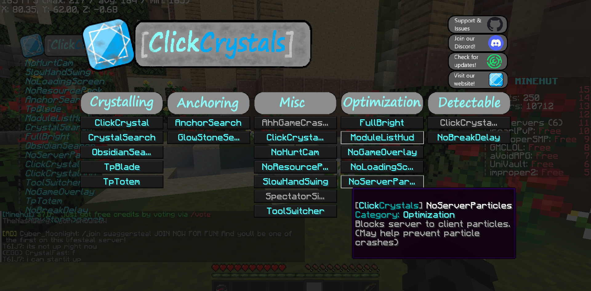

#  ClickCrystals [1.19.4]
Your ultimated crystal PvP assistance, ClickCrystals at your service.

---------------------------------------------------------------

## Newest Changes
```yml
Minecraft: 1.19.4
Mod: 1.19.4-0.7.1
Updated to: 1.19.4-0.7.1

Revamped GUI:
- overhauled the overall looks of the GUI for module toggling

Added Client-Side command:
- added (on client side) command aliases for /gamemode (`/gmc`,`/gms`,`gma`,`gmsp`)
```


## How Do I Use ClickCrystals?
```yml
KeyBindings:
   APOSTROPHE: Open module settings menu. (Settings are now saved!)
```
```yml
Commands:
   /cctoggle: <module> [on|off|help]
```
```yml
Modules: 
   AhhGameCrashed: "oops game crashed, rematch?"
   ClickCrystal: Punch a block of obsidian while holding an end crystal to place that crystal.
   CrystalSearch: The opposite of obsidian search.
   FullBright: Gives you infinite night vision, so you don't have to keep placing torches.
   GlowstoneSearch: Searches your hotbar for glowstone after right clicking a respawn anchor item.
   NoBreakDelay: Removes the annoying break delay between breaking two blocks.
   NoGameOverlay: See clearly under lava, etc!
   NoHurtCam: Play without damage tints!
   NoLoadingScreen: No more loading screens!
   NoResourcePack: Blocks server suggested and required resource packs!
   NoServerParticles: Never get particle-crashed again!
   ObsidianSearch: Search for obsidian after clicking a crystal.
   SlowHandSwing: Swing your hands slowly and without attack cooldown animation!
   SpectatorSight: Render entities as you do in spectator gamemode.
   TpBlade: Searches your hotbar for ender pearls after right clicking your sword item.
   TpTotem: TpBlade but with a totem.
```

## But isn't this cheating?
No, it is definetely not!
- This mod does not support macroing, cheating, etc.
- This mod aims to improve your performance in cpvp without ruining its pure experience!
- This mod has been tested on:
  - play.`PvPLegacy`.net
  - `McPvP`.club
  - west.`UsPvP`.org
  - east.`UsPvP`.org
  - `OgreDupe`.minehut.gg

## For this Mod You Will Need
```yml
Minecraft Java Edition: 1.19.4
Fabric Loader: 0.14.14 or higher
Fabric API: 1.19.4
To stop: complaining it is a cheat/macro.
```

## Have A Good One!
- Thanks for downloading ClickCrystals!
- Make sure to give it a star on my [Github](https://github.com/itzispyder/clickcrystals)
- Follow the project on [Modrinth](https://modrinth.com/mod/clickcrystals)

## SPECIAL THANKS AND SHOUTOUT TO
```yml
TheTrouper: For all the help and support, and giving me ideas!
breadandcarrots: For being a wonderful mod tester!
```

